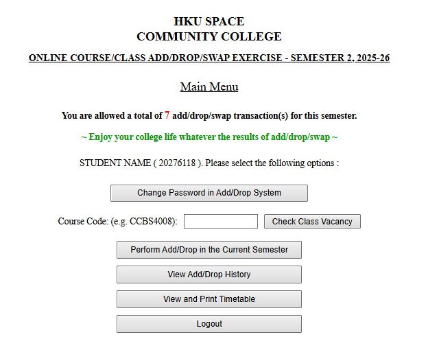
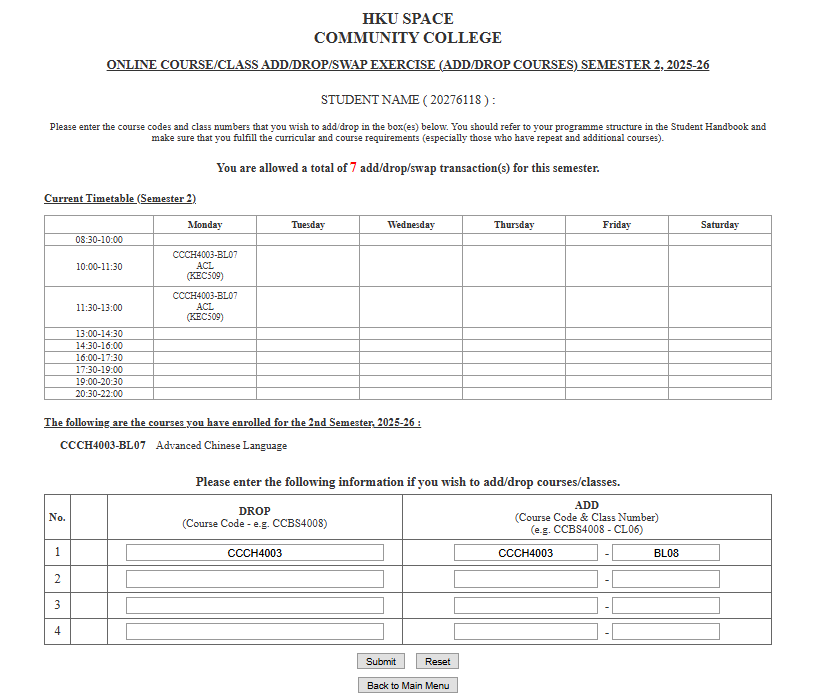
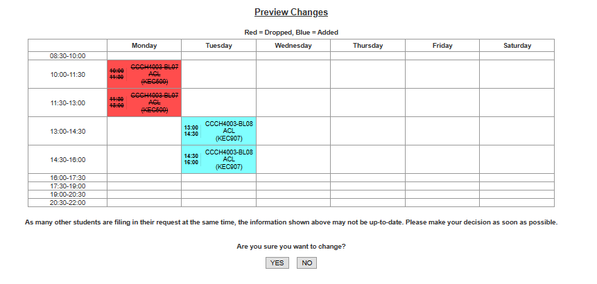

# HKU SPACE Add/Drop Simulation

An interactive web-based simulation of the HKU SPACE Community College course Add/Drop/Swap system for Semester 1, 2026-27, built to demonstrate front-end development skills.

## Features

- **Course Search & Timetable Setup** - Search courses by code, add/remove classes to build your personal timetable
- **Add/Drop/Swap Courses** - Submit add and drop requests with real-time validation
- **Time Conflict Detection** - Automatically detects scheduling conflicts between courses
- **Consecutive Class Limit** - Prevents scheduling more than 3 consecutive class slots (4.5 hours) in a single day
- **Class Vacancy Check** - View real-time vacancy information for each class
- **Preview & Confirmation** - Two-step confirmation process before committing changes
- **Transaction History** - Track all add/drop/swap activities
- **Password Management** - Change password functionality

## Tech Stack

- HTML5 / CSS3 / JavaScript (Vanilla)
- LocalStorage for data persistence
- No external frameworks required

## How to Run

### Option 1: Online (GitHub Pages)
Visit the live demo at: **https://mashlekun.github.io/HKU-SPACE-Course-Class-Add-Drop-Swap-Exercise/**

### Option 2: Local
```bash
# Clone the repository
git clone https://github.com/mashlekun/HKU-SPACE-Course-Class-Add-Drop-Swap-Exercise.git

# Open index.html in any modern web browser
# (Just double-click the file or drag it into your browser)
```

## Screenshots

### Login Page


### Main Menu


### Add/Drop Page


### Preview Changes


## Project Structure

```
adddrop_simulation/
├── index.html              # Main application
├── style.css               # Styles
├── courses.js              # Course data
├── convert_courses.js      # Course data converter
└── image/
    ├── login_page.png
    ├── main_page.png
    ├── add_drop_page.png
    ├── preview_change.png
    └── HKUSPACE_logo.png
```

## Data Disclaimer

This is a **simulation project** for educational and demonstration purposes only. All course data and vacancy information are randomly generated and do not reflect actual HKU SPACE course offerings.